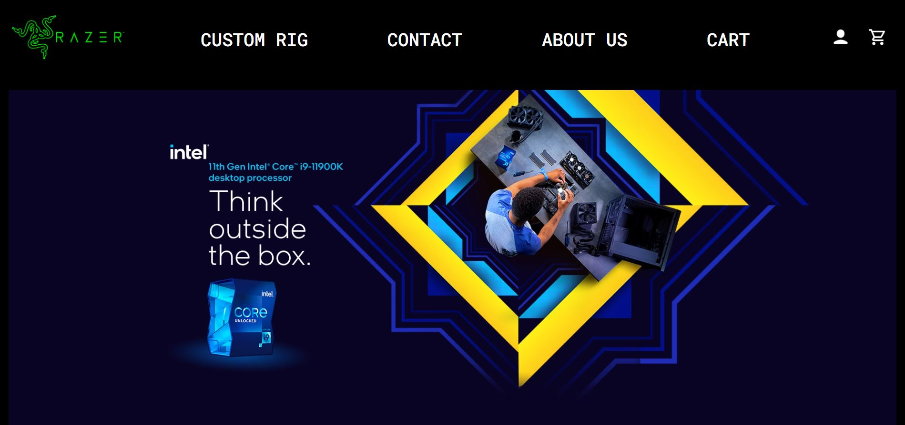
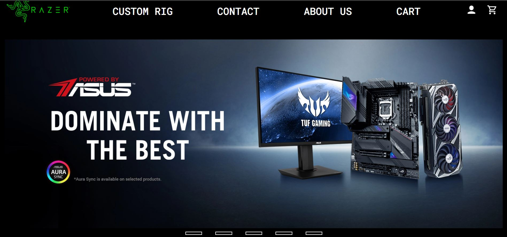
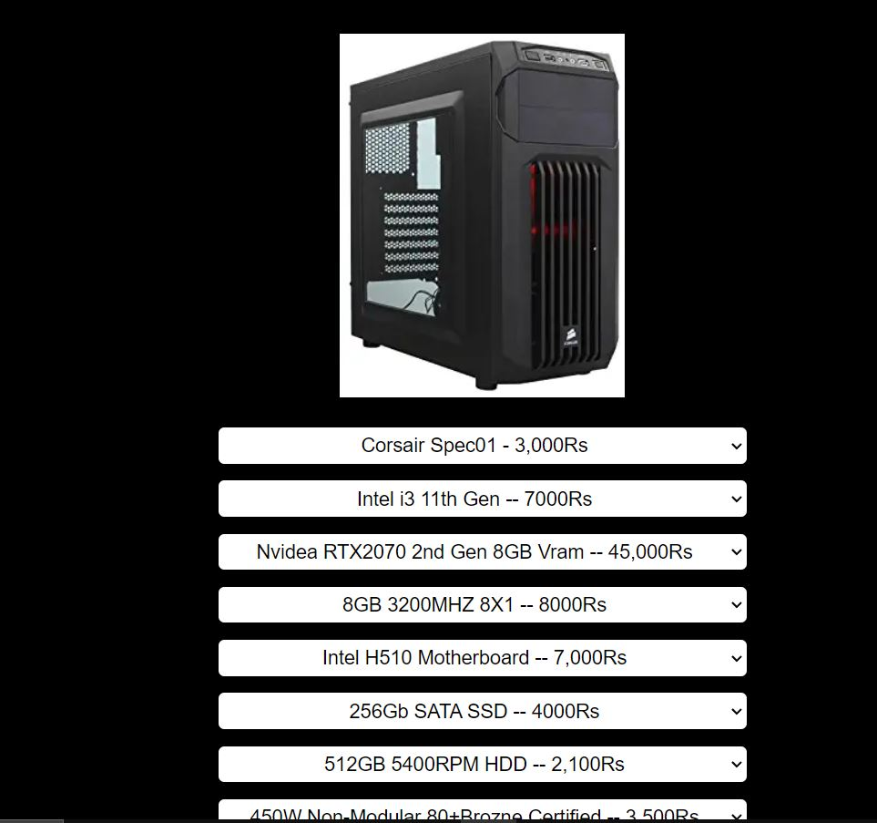
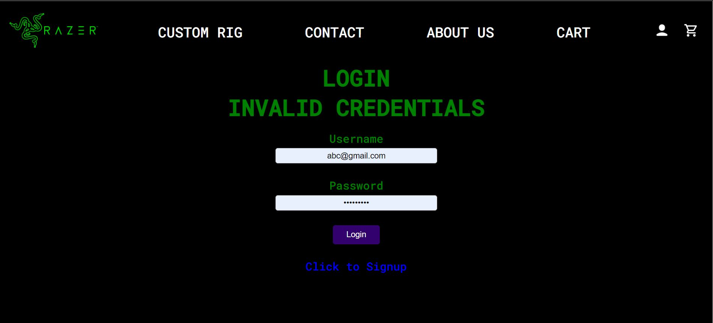

# 💻 PC Building Website

This is a PC Building Website where users can have a great experience creating custom PCs with parts of their choice. The website is designed to give a smooth and interactive interface for both beginners and enthusiasts looking to assemble a custom rig.

---

## 🚀 Features

- 🧩 **Custom PC Builder** – Select from a wide range of components like CPU, GPU, RAM, Storage, etc.
- 💳 **Razorpay Payment Integration** – Secure payment processing using Razorpay.
- 🧾 **Invoice Generation (PDF)** – Generate and download tax invoices using the **TCPDF** library.
- 🔒 **User Authentication** – Secure login system with hashed passwords and PHP sessions.
- 📦 **Cart Functionality** – Users can add parts to their cart and view the total before checking out.
- 📧 **Email Confirmation** – Sends confirmation emails to users via SMTP.

---

## 🧑‍💻 Technologies Used

- **PHP**
- **MySQL**
- **HTML / CSS**
- **JavaScript** (for dynamic UI)
- **TCPDF** (for invoice generation)
- **Razorpay API** (for payments)

---

## 🖼️ Design Previews

### 🏠 Home Page with Scrollable Banner



This is the home page where we have implemented scrollable banners using checkbox-based logic and styled transitions.

---

### 🔧 Custom PC Builder Page


On this page, users can select from a variety of PC parts along with pricing options to customize their own build.

---

### 🔐 Login Page


This is the login page. Here, the user has entered invalid credentials.

- We implemented user authentication using `PHP $_SESSION` variables.
- User passwords are securely stored in the database using hashing (e.g., `password_hash()` function).

---

## 📁 Project Structure Overview

- `home.php` – Landing page
- `custom_rigs.php` – Component selection for building PC
- `cart.php` – Shows items added to cart
- `checkout.php` – Integrates Razorpay payment
- `generate_invoice.php` – PDF invoice generation using TCPDF
- `connect_database.php` – MySQL connection
- `send_mail.php` – Sends confirmation mail via SMTP
- `about_us.php` / `contact.php` – Informational pages

---

## ⚙️ Configuration Notes

> ✅ Before running the project, make sure you configure the following:

- In **`checkout.php`**, **add your Razorpay API Key ID and Secret**:
  ```php
  $apiKey = 'your_razorpay_api_key';
  $apiSecret = 'your_razorpay_secret';
  In send_mail.php change these
$mail->Username = 'your_email@gmail.com';
$mail->Password = 'your_app_password';


Let me know if you'd like me to export this as a `.md` file or include it directly in your project folder for you!

